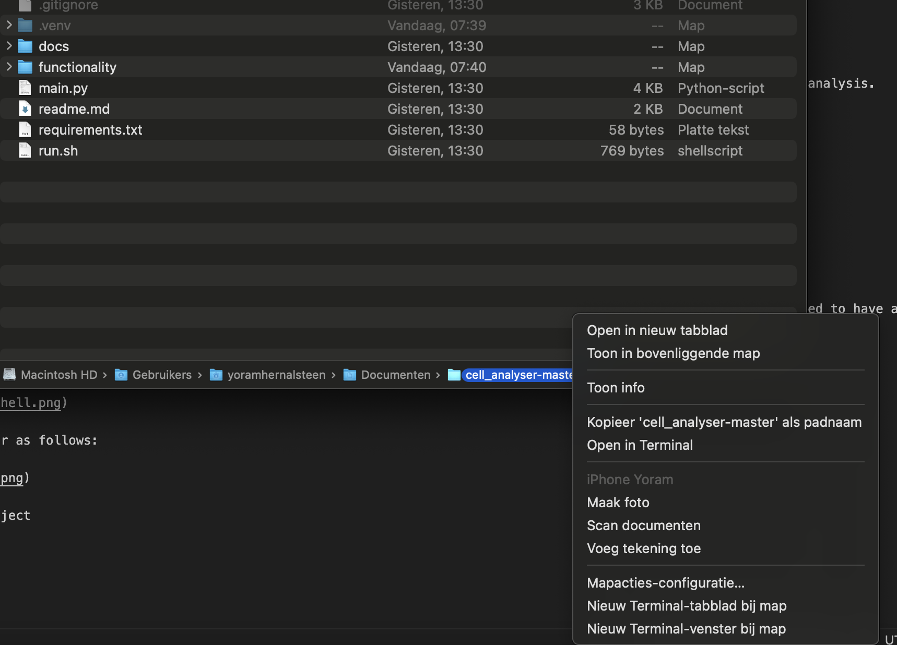
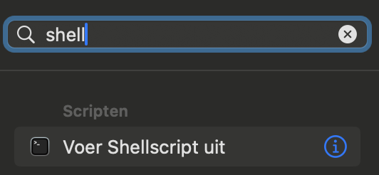
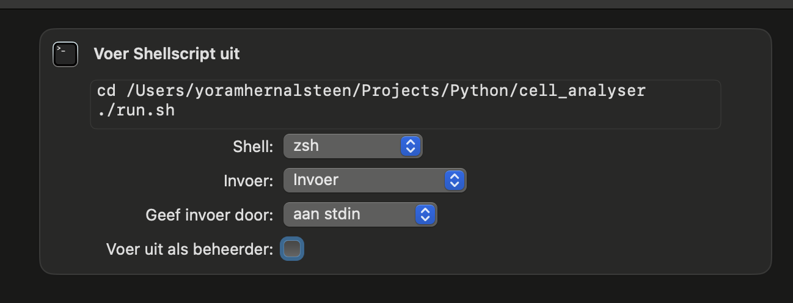
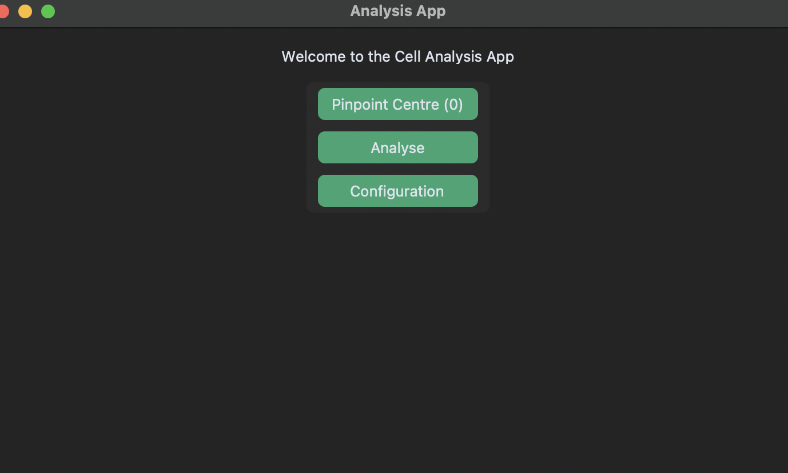
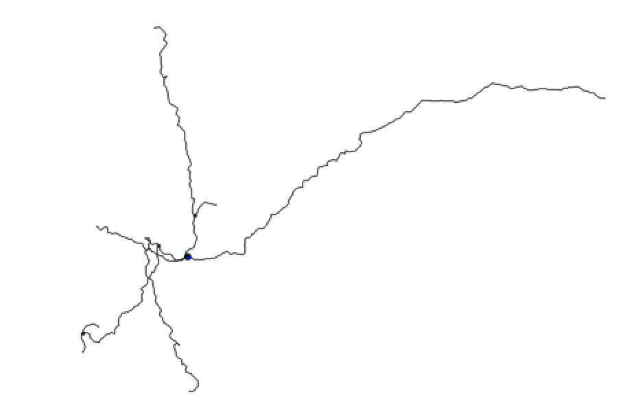
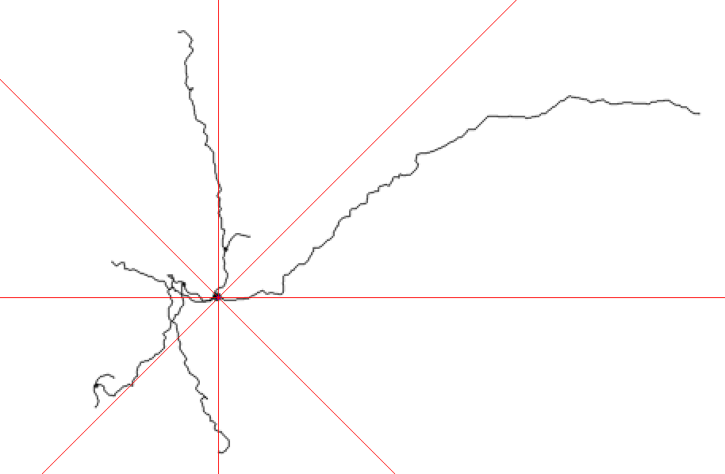

# How to run the application

Open the terminal in the folder where you downloaded the application and run 'chmod +x run.sh'. This will make sure you can run the script.

Then you have two options:

1. Run via ./run.sh in terminal
2. Create a task (more info below)

You can use Tasks (opdrachten) to automate the installation of dependencies and requirements needed for the application. You will need to have a working python 3 installation (preferably python 3.9 or higher.)

First select shell script.

Then fill in the parameter as follows:

cd folder path of the project

./run.sh

# How to use cell analysis app.

## Configure the input, output and analysis folders the application will use.

The input folder will be scanned to check if we need to pinpoint the centre of cells in images. Please copy the path of the input folder here.

The output folder is of no importance to the user. Here processed files (files with the blue dot as centre) are saved. These are used to do direction analysis on.

The analysis folder has the results of the direction analysis. Every input image has a csv file (same name)with the results (percentage and absolute amount of pixels) per part (topright1, topright2, bottomright1, bottomright2, bottomleft1, bottomleft2, topleft1, topleft2). A picture with a visual representation of the algorithm is also generated.

## Pinpoint the centre of the cell

The application will ask you per file in the input folder that is not yet converted to click on the centre of the cell. This will output a blue point on the selected place.

1. Click on the centre of the cell
2. Press S to save, Q to quit.

## Analyse the cell

The application will analyse the direction of the cell and create a csv file (percentage per part) and visual representation of the analysis.

The first part is topright 1, the last part is topleft 2.

